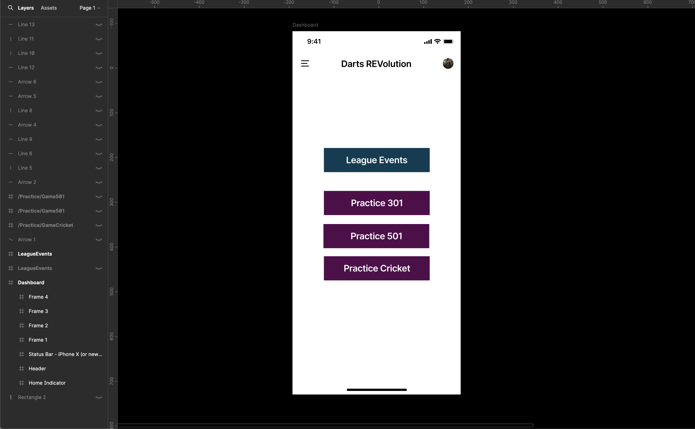
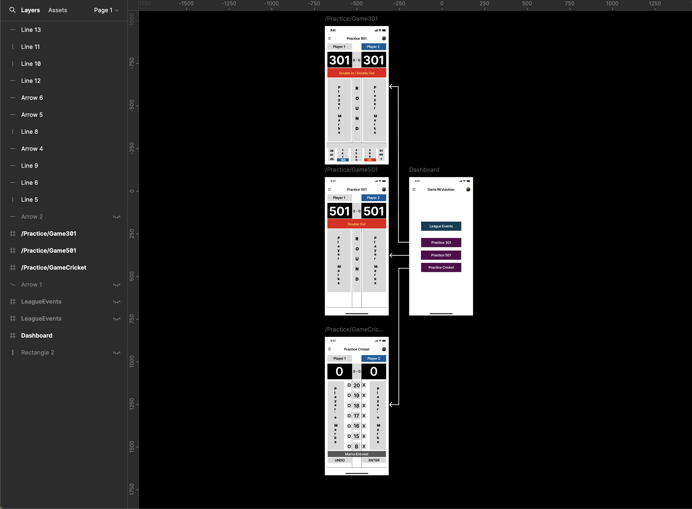
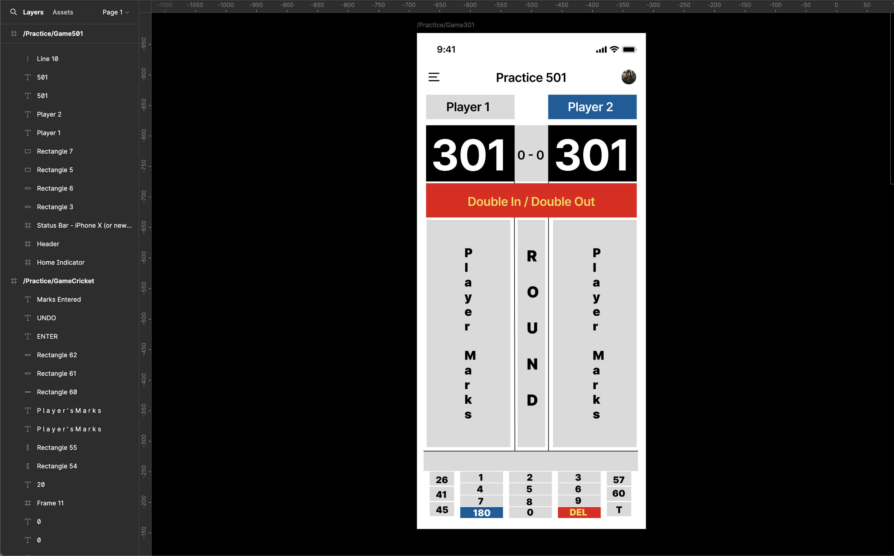
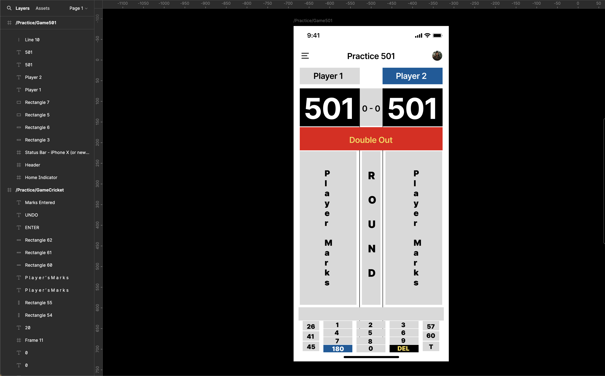
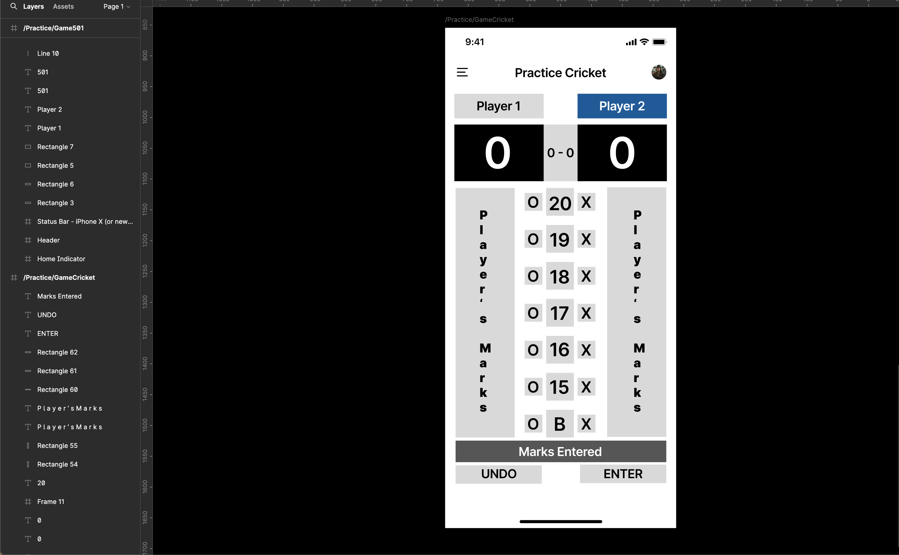
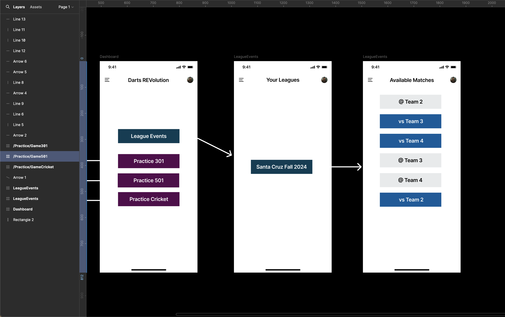

# Dart Rev (Dart Revelution)

### A Dart Scoring Keeping App

## :pencil: Description

Dart Rev is a darts score keeping app that will keep track of all your darting data plus seamlessly integrates with a league for added customization that other apps don't allow.

## :camera_flash: Screenshots

### Wireframes

|                    Description                     | Screenshot                                                     |
| :------------------------------------------------: | -------------------------------------------------------------- |
| <h3 align="center">Homepage w/ Logged-in User</h3> |  |
|       <h3 align="center">Practice Games</h3>       |        |
|            <h3 align="center">301 </h3>            |              |
|            <h3 align="center">501 </h3>            |              |
|          <h3 align="center">Cricket </h3>          |          |
|        <h3 align="center">League View </h3>        |         |

## :computer: Technologies Used

